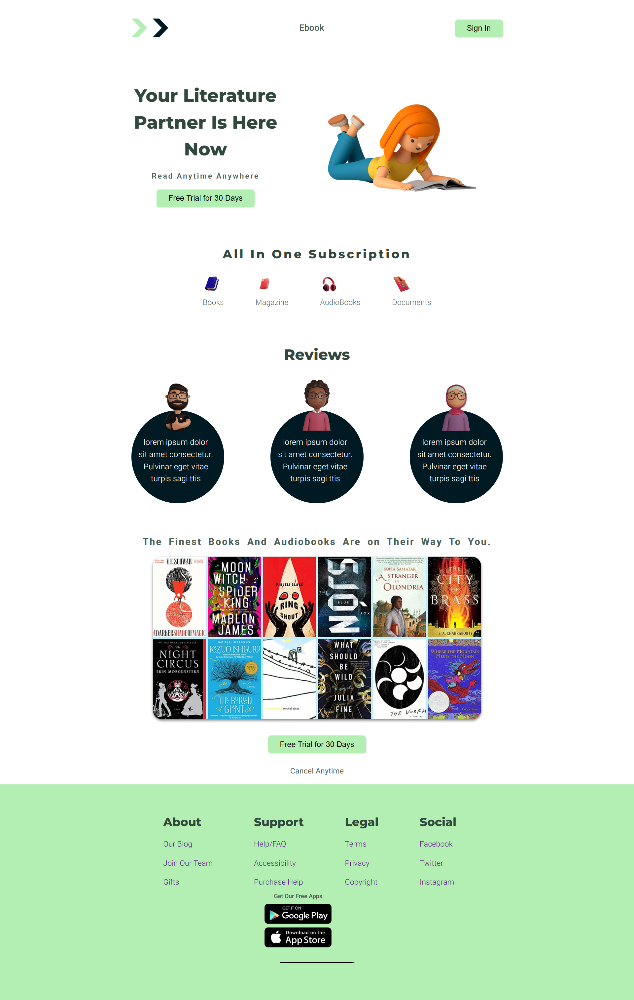

# 📚 Ebook Landing Page

A fully responsive **eBook landing page** built using **HTML** and **CSS** and JS, designed to showcase a digital reading platform offering books, magazines, audiobooks, and documents.

---

## 🌐 Live Demo

[🔗 View Project Online](https://elaborate-rabanadas-ccb45a.netlify.app/)

---

## 🛠 Tech Stack

- **HTML5** – Semantic and accessible structure
- **CSS3** – Custom design system with variables and responsive layout
- **Flexbox & CSS Grid** – For layout alignment
- **Google Fonts** – Montserrat and Roboto for clean typography

---

## 📱 Responsive Design

Designed for:

- **Mobile phones** (≥ 320px)
- **Tablets** (≥ 480px)
- **Small laptops & desktops** (≥ 768px and ≥ 1024px)

---

## 📌 Features

- Custom landing page layout
- Call-to-action buttons (Free Trial)
- Subscription options (Books, Magazine, Audiobooks, Documents)
- User reviews section
- Footer navigation with social/media links

---

## 📸 Screenshot



---

## 📘 What I Learned

- How to structure a semantic and accessible HTML layout.
- Creating and applying custom CSS design systems using variables.
- Building **fully responsive** layouts with **Flexbox** and **CSS Grid**.
- Using **media queries** to support different screen sizes.
- Improving visual hierarchy and spacing using design principles.

## 📂 How to Use

1. Clone the repo:
   ```bash
   git clone https://github.com/rehmali/ebook-landing-page.git
   ```
